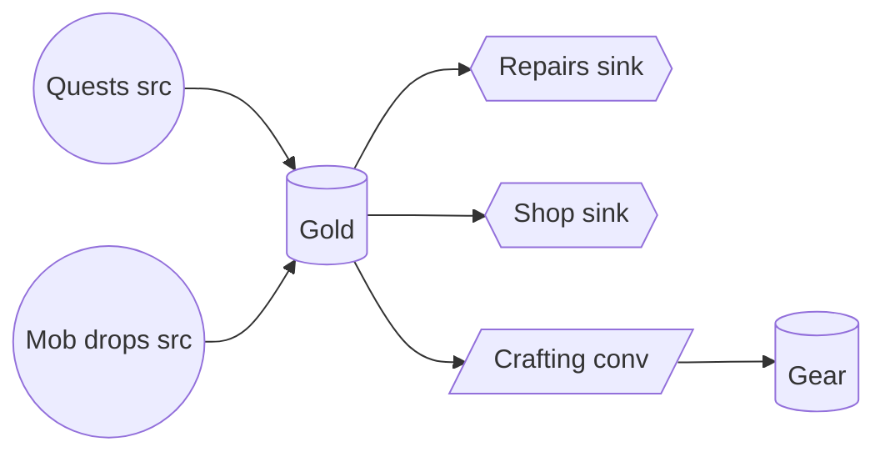

# Economy Model Report Template

## 1. Scope and assumptions
- Archetypes: casual (20 min/session, 2 sessions/day), core (60 min, 3/day).
- Target: casual buys the first mount on day 3.

## 2. Node map

## 3. Rate table
| flow | type | resource | casual /min | core /min | gate |
|---|---|---|---|---|---|
| Quests | source | gold | 8 | 10 | daily cap 600 |
| Mob drops | source | gold | 4 | 9 | none |
| Repairs | sink | gold | 2 | 5 | scales with gear tier |

## 4. Worked math
- Casual net gold = 8 + 4 − 2 = 10/min -> 400/day (40 min/day).
- Mount price 1,500 -> T = 1,500 / 400 = 3.75 equivalent play-days. Target is 3 days: **miss by 25%**. Lever: raise quest gold to 10.5/min, giving (10.5 + 4 − 2) × 40 = 500/day and T = 3.0 days. The daily quest cap does not bind at this playtime. These are continuous-rate estimates; actual availability also depends on session timing and reward granularity.
- Core net = 10 + 9 − 5 = 14/min, but quest cap binds at 600/day: daily = 600 + (9 − 5)·180 = 1,320 -> T = 1.1 days. Gap casual/core = 3.4x; acceptable if intent is ≤ 4x.

## 5. Issues and levers
| issue | evidence | lever |
|---|---|---|
| Possible excess accumulation (synthetic scenario) | sink/source = 0.4 at day 30; no price or stock observations supplied | inspect reserves and desired purchases before proposing a fee; this ratio alone does not prove inflation |
